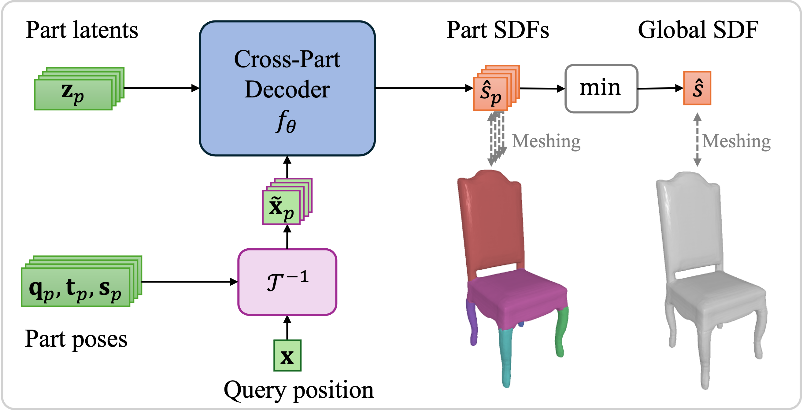
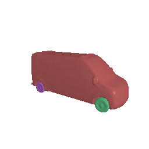

# PartSDF
This is the PyTorch implementation of the paper "**PartSDF: Part-Based Implicit Neural Representation for Composite 3D Shape Parametrization and Optimization**".   
**[[Paper](https://arxiv.org/abs/2502.12985)]**

<p style="display: flex; align-items: center;">
    
    
</p>

## File structure
This repository is organized as follow:

    PartSDF/
    ├── experiments/        <- Experimental config and results
    │   └── template/
    │       └── specs.json  <- Template experimental config
    ├── notebooks/          <- Jupyter notebooks for visualizing results
    ├── scripts/            <- Python scripts
    └── src/                <- Source code

See below for the data files structure.


## Installation
PartSDF was tested with **Python 3.10** and **PyTorch 2.0.0+cu118**. If you wish to use different versions, you may need to adapt the following commands.

Install the requirements with
```bash
pip install --upgrade pip
pip install numpy==1.24.2 matplotlib scipy imageio pillow scikit-image trimesh libigl jupyterlab
```
Then, install PyTorch and PyTorch3d (which is used for renderings and image consistency):
```bash
pip install torch==2.0.0 --index-url https://download.pytorch.org/whl/cu118
pip install --no-index pytorch3d -f https://dl.fbaipublicfiles.com/pytorch3d/packaging/wheels/py310_cu118_pyt200/download.html
```

## How to use
**Note:** the scripts can be launched from the main directory with:
```bash
python3 scripts/script.py [--option [VALUE]]
```
Please, refer to the script itself or use the `--help` options for details regarding its options.

### Data
(See below for the data we used in the paper.)

To start, you need the meshes of the full shapes and of the individual parts, *e.g.*:

    dataset_raw/
    ├── meshes/                 <- Meshes of the full shapes
    │   └── <instance_name>.obj
    └── parts/                  <- Parts meshes (numbered from 0 to max-1)
        └── <instance_name>/
            └── part<i>.obj

The rest will be generated by the scripts (see below).
The final data file structure will ressemble this:

    dataset/
    ├── meshes/
    ├── normalization/          <- Normalization factors for each mesh from dataset_raw
    ├── parts/
    │   ├── meshes/
    │   ├── parameters/         <- Pose parameters of the parts
    │   ├── primitives/         <- Meshes of the parts primitives
    │   └── samples_labels/     <- Part labels of the samples in dataset/samples/
    ├── samples/                <- 3D and SDF samples
    └── splits/                 <- Split files (each is a list of instance names)

For the following instructions, the processing can be parallelized over the shapes on `nproc` sub-processes to speed things up. Choose `nproc` based on your machine, below we use `--nproc 10` as an example.

Build the data as follow:
```bash
# 1. Normalize the meshes and parts to the [-0.9, 0.9]^3 cube
python3 scripts/data_normalize_meshes.py <path/to/dataset_raw/meshes> <path/to/dataset> --nproc 10
python3 scripts/data_normalize_parts.py <path/to/dataset_raw/parts> <path/to/dataset> --nproc 10
```
```bash
# 2. Generate the surface and SDF samples (step 4 can be done in parallel to steps 2&3) * 
python3 scripts/data_generate_samples.py <path/to/dataset> --nproc 10
```
```bash
# 3. Label the SDF samples with parts
python3 scripts/data_label_samples.py <path/to/dataset> <n_parts>  --nproc 10
```
```bash
# 4. Fit a primitive to each part to get its pose **
python3 scripts/data_fit_primitives.py <path/to/dataset> <n_parts> --primitive cuboid  --nproc 10
```

*: If your meshes are not *watertight*, you may want to use [`mesh-to-sdf`](https://github.com/marian42/mesh_to_sdf) by adding `--mesh-to-sdf` to *step 2* above, or to subsitute it with any other preferred method. Mesh-to-sdf is, however, *very* slow and it may take a couple of weeks to process a large dataset of unclean meshes.

**: Alternatively, if you wish to have settings *per part*, you can create a `JSON` file with the arguments and use `--specs <path/to/fit_prim_specs.json>`.


### Training
To train a model, first create an experiment directory, *e.g.*, under `experiments`, then copy there the template specifications `experiments/template/specs.json`, and adapt it as needed (such as data and part paths). Then, launch the training with:
```bash
python3 scripts/train.py <experiments/expdir>
```
The models, latents, and poses will be saved in `<experiments/expdir>`.


### Reconstruction and evaluation
After training, reconstruct the test shapes with:
```bash
python3 scripts/reconstruct.py <experiments/expdir> --partsdf --parts --test
```
The reconstructions (meshes, parts, latents, and poses) will be saved in `<experiments/expdir>/reconstruction/<epoch>_parts/`.

Once that is done, you can evaluate them by running:
```bash
python3 scripts/evaluate.py <experiments/expdir> --parts --test
```
The metric values will be saved per-shape under `<experiments/expdir>/evaluation/<epoch>_parts/`.


## Datasets and checkpoints

### Pre-processed datasets
You can find our processed meshes, parts, and splits here:
1. [Car](https://drive.google.com/file/d/19U-6TEBLq0pJbsKpFX0ptcLzGckdTxwj/view?usp=sharing)
2. [Mixer](https://drive.google.com/file/d/1NtSLewlGysF2RgnXRsp2CfGmJQHzk3lV/view?usp=sharing)
3. *Chair* (under work, current meshes are too heavy)

For earch dataset, you will find the full shape meshes, the parts meshes, the specs for the primitive fitting (`fit_prim_specs.json`, see **Data** step 4 above), and the splits. 

For the splits, `train.json` and `test.json` are the training and test splits we used in the paper, while `train_train.json` and `train_valid.json` are the training and validation splits (sub-sampled from `train.json`) used to choose hyper-parameters.

### Pre-trained models checkpoints
You can find the checkpoints of our trained models here:
1. [Car](https://drive.google.com/file/d/1pBR8ptTp_VyBFlZK9oxtRnHrdw8CgWsr/view?usp=sharing)
2. [Mixer](https://drive.google.com/file/d/1qF4xG8y5DR0iWR7bE0W79siW4V5Z6BNy/view?usp=sharing)
3. [Chair](https://drive.google.com/file/d/1H5Oig-HqR6sF3DNiWvpfavTNVEK6olSF/view?usp=sharing)

These folders can be decompressed under `experiments/`.

## Citation
If you found PartSDF useful for your work, please cite us:
```
@misc{talabot2025partsdf,
    title={PartSDF: Part-Based Implicit Neural Representation for Composite 3D Shape Parametrization and Optimization}, 
    author={Nicolas Talabot and Olivier Clerc and Arda Cinar Demirtas and Doruk Oner and Pascal Fua},
    year={2025},
    eprint={2502.12985},
    archivePrefix={arXiv},
    primaryClass={cs.CV},
    url={https://arxiv.org/abs/2502.12985}
}
```


## TODO
* [X] Make `scripts/data_fit_primitive.py` configurable *per-parts*
* [ ] Notebook for shape manipulation
* [X] Model checkpoints


-------------------------------------------------------------
*Based on the https://github.com/ntalabot/base-inr template.*